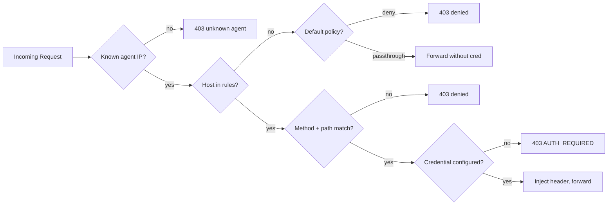

# Auth Proxy — Flow Diagram & Loose Ends

## Request Flow

```mermaid
flowchart TD
    subgraph INTERNAL["Docker --internal network (no internet)"]
        A1[Agent PA<br/>172.30.0.10] -->|HTTP_PROXY| P
        A2[Agent TeslaCoil<br/>172.30.0.11] -->|HTTP_PROXY| P
        A3[Agent N<br/>172.30.0.x] -->|HTTP_PROXY| P
    end

    subgraph PROXY["Auth Proxy (172.30.0.2)"]
        P[Port 3100<br/>Main Proxy] --> ID{Identify Agent<br/>by source IP}
        ID --> POL{Policy Engine<br/>host + method + path}
        POL -->|DENY| BLOCK[403 Denied]
        POL -->|ALLOW| CRED{Credential<br/>Lookup}
        CRED -->|found| INJECT[Inject Auth Header]
        CRED -->|missing| AUTH[403 AUTH_REQUIRED<br/>webhook to OpenClaw]
        INJECT --> FWD[Forward to upstream]

        UP1[Port 3101<br/>GitHub upstream] --> ID
        UP2[Port 3102<br/>Vercel upstream] --> ID
    end

    subgraph EXTERNAL["External Network"]
        FWD -->|HTTPS| GH[api.github.com]
        FWD -->|HTTPS| VER[api.vercel.com]
        FWD -->|HTTPS| GCP[*.googleapis.com]
    end

    subgraph CREDS["Credential Store (in-memory)"]
        ENV[env vars]
        FILE[JSON file + pointer]
        EXEC[exec binary<br/>1Password / Vault / sops]
    end

    CRED -.->|resolve| CREDS

    subgraph ADMIN["Admin API (localhost:3180)"]
        AUD[/audit/recent<br/>/audit/stats]
        AUTHAPI[/auth/pending<br/>/auth/approve<br/>/auth/deny]
        HEALTH[/health<br/>/config<br/>/agents]
    end

    AUTH -.->|webhook POST| OC[OpenClaw Gateway]
    OC -.->|WhatsApp prompt| USER[Richard]
    USER -.->|tap approve| AUTHAPI
```

## Decision Flow (per request)



## Loose Ends

### P0 — Must have before integration

| # | Issue | Status | Notes |
|---|---|---|---|
| 1 | **HTTPS upstream ports E2E** | Designed, not E2E tested | Agents use `http://proxy:3101` for GitHub. Need to verify `gh` CLI works with `GH_HOST` override |
| 2 | **Package manager access** | Not addressed | `apt`/`pip`/`npm` need passthrough rules to registries. Without it, agents can't install tools |
| 3 | **Graceful shutdown** | Missing | Signal handling + drain in-flight requests |

### P1 — Important for real use

| # | Issue | Status | Notes |
|---|---|---|---|
| 4 | **Credential rotation / 401 retry** | Missing | Detect upstream 401, re-resolve creds from backend, retry once |
| 5 | **Config hot reload** | Missing | Watch config file, reload without restart |
| 6 | **CLI tool compatibility** | Untested | `gh`, `vercel`, `gcloud`, `git` — document which env vars each needs |
| 7 | **Reactive auth → OpenClaw webhook** | Webhook fires, no receiver | Need OpenClaw hook handler + WhatsApp approval UX |

### P2 — Nice to have

| # | Issue | Status | Notes |
|---|---|---|---|
| 8 | **GitHub App credential backend** | Designed, not built | Short-lived installation tokens instead of PATs |
| 9 | **DNS resolver on proxy** | Low risk | `--internal` + default deny covers it. Edge case only |
| 10 | **Multi-instance / HA** | N/A for now | Proxy is stateless, easy to scale later |
